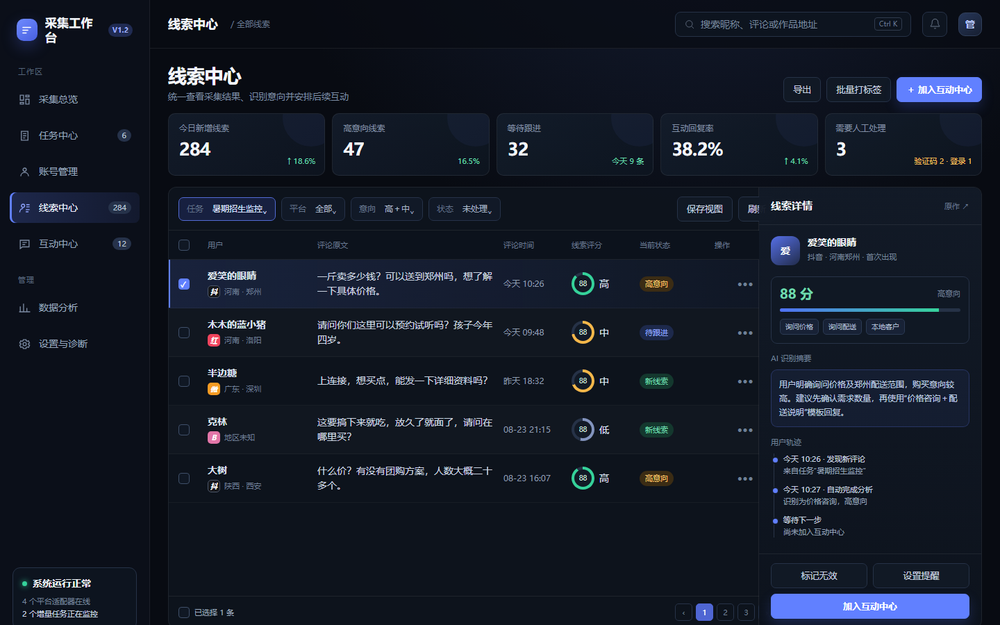

# 多平台采集工作台 v1.2—v2.0 总体升级方案

## 0. 文档信息

- 当前基线版本：v1.1.1
- 第一阶段目标版本：v1.2
- 第二阶段目标版本：v2.0
- 当前平台范围：抖音、小红书、B站、微博
- 本轮范围：不增加新平台，先完成稳定性、运营能力和界面升级
- 核心安全原则：真实发送每次启动默认关闭；验证码只转人工，不设计绕过机制
- GUI验收原则：只有从最终GUI程序实际运行后截取的图片，才是最终效果图

---

## 1. 项目定位

项目不再只定位为“多平台评论采集工具”，而是升级为：

> 集采集任务、账号管理、线索识别、用户去重、人工审核、互动回复、跟进提醒、效果分析和运行诊断于一体的本地多平台线索运营工作台。

完整业务链路：

```text
关键词与监控规则
        ↓
多平台搜索与作品发现
        ↓
详情、评论和用户信息采集
        ↓
清洗、标准化、去重、评分
        ↓
线索中心人工筛选
        ↓
互动中心生成和审核回复
        ↓
模拟填入 / 人工确认真实发送
        ↓
回复结果、用户轨迹和后续跟进
        ↓
模板、关键词、账号和任务效果分析
```

---

## 2. 当前基础与主要问题

### 2.1 已有能力

- 抖音、小红书、B站、微博四个平台采集。
- 多账号和 BitBrowser 浏览器环境管理。
- 搜索、作品详情、评论懒加载与滚动采集。
- 任务暂停、继续、补采、暂无更多内容等基本流程。
- 线索中心和互动中心。
- 四个平台评论定位、回复入口点击和回复内容填入。
- 模拟回复默认不点击最终发送按钮。
- 真实发送会话开关默认关闭。
- 评论原文、失败原因、平台账号匹配和运行日志。
- SQLite 本地数据库、发布包和自动更新基础。

### 2.2 当前关键问题

1. GUI 与采集、浏览器、数据库逻辑仍然耦合较深。
2. Tkinter/CustomTkinter 在复杂表格、窗口缩放和动态刷新方面存在上限。
3. 平台采集规则分散，新增功能容易在主程序中继续叠加条件判断。
4. 任务暂停、验证、超时、补采和暂无更多之间还需要统一状态定义。
5. 日志已经较完整，但缺少面向普通用户的诊断中心和运行时间线。
6. 线索仍以单条评论为主，缺少稳定的“用户主档”和跨任务历史轨迹。
7. 缺少长期增量监控、关键词组、可解释评分、跟进提醒和效果分析。
8. HTML或图片效果图与最终 Tkinter 实现之间容易产生巨大视觉偏差。

---

## 3. 总体目标

### 3.1 第一阶段目标：稳定、可恢复、可诊断

- 浏览器采集不能再拖慢 GUI。
- 任务任何阶段退出后都能明确恢复。
- 同一作品、评论和用户不会反复创建重复数据。
- 用户可以明确看到任务为什么暂停、为什么结束、为什么失败。
- 支持定期增量监控和关键词组。
- 支持规则评分、用户主档、账号安全、平台健康和自动备份。

### 3.2 第二阶段目标：漂亮、流畅、适合日常运营

- 使用 PySide6＋Qt Quick/QML 重建桌面界面。
- 页面切换、列表滚动、窗口拖动和缩放保持连续流畅。
- 使用统一的设计系统和可复用组件。
- 建立用户跟进、AI辅助、模板效果和转化分析。
- 效果图与最终GUI来自同一份QML代码，消除设计与实现偏差。

### 3.3 本轮不做

- 不增加第五个平台。
- 不绕过验证码、风控或平台安全机制。
- 不在第一阶段整体重写 GUI。
- 不允许 AI 自动决定真实发送。
- 不自动把不同平台的同名用户合并为同一个人。
- 不在没有备份和回滚验证前改变用户数据库。

---

## 4. 总体技术架构

### 4.1 目标结构

```text
┌──────────────────────────────────────┐
│             桌面 GUI                 │
│ 页面、筛选、表格、详情、操作确认      │
└──────────────────┬───────────────────┘
                   │ 本地事件与命令
┌──────────────────▼───────────────────┐
│            本地任务服务              │
│ 调度、状态机、队列、限速、恢复、通知   │
└───────┬──────────┬──────────┬────────┘
        │          │          │
   抖音适配器  小红书适配器  B站适配器  微博适配器
        │          │          │
┌───────▼──────────────────────────────┐
│ 数据层：SQLite、写入队列、迁移、备份   │
└──────────────────────────────────────┘
```

### 4.2 分层职责

#### GUI 层

- 只负责展示、编辑、筛选、确认和下发操作。
- 不直接执行浏览器操作。
- 不在主线程进行数据库查询、导出、图片处理或 AI 请求。
- 只更新发生变化的数据，不定时重建整页。

#### 本地任务服务

- 维护任务、账号和运行状态。
- 负责队列、暂停、继续、人工验证和失败恢复。
- 负责操作间隔、账号额度、工作时间和连续失败保护。
- 向 GUI 推送增量事件。

#### 平台适配器

- 只处理对应平台的搜索、排序、滚动、详情、评论和回复定位。
- 输出统一数据结构，不直接操作 GUI。
- 不直接依赖其它平台适配器。
- 声明自身支持的搜索排序、评论、地区、回复等能力。

#### 数据层

- 统一处理写入、查询、索引、迁移和备份。
- 保存原始证据与标准化数据。
- 所有关键状态变化带时间、来源和运行编号。

---

## 5. 第一阶段：v1.2 底层稳定与核心能力

## 5.1 模块一：回归基线和运行编号

### 实施内容

- 冻结四个平台当前已验证的搜索、滚动、详情、评论和模拟回复行为。
- 建立脱敏的固定测试数据和四平台回归用例。
- 每次任务执行生成 `run_id`。
- 每个作品、评论和回复操作都可以追溯到任务、账号和 `run_id`。
- 失败时按 `run_id` 保存操作日志、网址、页面状态和必要截图。

### 验收标准

- 任意失败都能通过一个编号重建完整时间线。
- 测试包和发布包不包含用户个人数据、真实账号和浏览器窗口 ID。
- 四平台模拟回复仍然只填入，不发送。

## 5.2 模块二：GUI 和采集执行分离

### 实施内容

- 将 `scheduler`、浏览器操作和长时间任务移入独立后台服务。
- GUI 和后台服务通过本地命令与事件接口通信。
- 每个平台、每个账号建立受控执行队列。
- 单个账号卡住不能阻塞其它账号。
- GUI 重启后重新连接后台服务并恢复任务真实状态。
- 后台服务异常退出时，GUI 显示明确提示并允许安全重启服务。

### 统一任务状态

- 等待执行
- 正在搜索
- 正在采集详情
- 正在采集评论
- 等待页面加载
- 需要人工验证
- 暂停中
- 正在停止
- 暂无更多内容
- 已完成
- 失败

### 状态原则

- 暂停后不再启动新页面操作。
- 正在执行的最小步骤安全结束后进入暂停。
- 人工验证完成后继续使用原账号。
- “暂无更多内容”必须由明确页面提示或完整终止规则产生。
- Timeout 只能作为异常，不能自动等同于“暂无更多”。

### 验收标准

- 后台采集运行时，GUI拖动、缩放和页面切换不受影响。
- GUI关闭再打开后可以看到后台任务真实状态。
- A账号出现验证时不能错误切换为B账号继续原任务。

## 5.3 模块三：断点、去重、补采与增量监控

### 数据断点

每轮运行保存：

- 已执行的关键词组合。
- 已发现作品 ID 和作品地址。
- 已完成详情的作品。
- 已完成评论的作品。
- 当前账号和浏览器窗口。
- 当前搜索位置与滚动状态摘要。
- 本轮结束原因。

### 去重规则

- 作品：平台＋作品 ID。
- 评论：平台＋作品 ID＋评论 ID。
- 评论 ID 不稳定时：平台＋作品 ID＋规范化用户标识＋纯文字评论＋评论时间。
- 用户：同平台优先使用平台用户 ID，其次主页地址或稳定账号标识。
- 昵称不能单独作为用户合并依据。

### 增量监控

任务支持：

- 单次执行。
- 每天指定时间执行。
- 每隔指定分钟或小时执行。
- 仅在指定工作时间运行。
- 手动立即运行一次。

每轮展示：

- 页面发现数量。
- 历史重复数量。
- 新增作品数量。
- 新增评论数量。
- 新增用户数量。
- 失败数量。
- 本轮结束原因。
- 下次运行时间。

### 验收标准

- 补采不会重复写入历史作品和评论。
- 页面刷到历史内容时继续观察，不立即判定没有新内容。
- 出现新内容时无需等待完整10秒。
- 没有新内容时完成规定等待和终点检测后再结束。

## 5.4 模块四：关键词组

### 数据结构

一个关键词组包含：

- 组名。
- 核心词。
- 同义词。
- 地域词。
- 排除词。
- 适用平台。
- 创建时间和版本号。

### 使用方式

- 新建任务可以选择已有关键词组，也可以临时输入单个关键词。
- 创建任务前预览最终搜索组合。
- 用户可以取消不需要的组合。
- 关键词组修改后生成新版本，不改变历史任务记录。

### 效果统计

按关键词统计：

- 发现作品数。
- 新增评论数。
- 有效线索数。
- 高意向线索数。
- 进入互动中心数量。
- 已回复数量。

## 5.5 模块五：用户主档和历史轨迹

### 用户主档内容

- 平台用户标识。
- 当前昵称和历史昵称。
- 主页地址。
- 地区信息及来源。
- 首次发现时间。
- 最近出现时间。
- 关联任务。
- 关联作品和全部评论。
- 线索评分和人工标签。
- 互动记录和失败记录。
- 跟进状态和备注。

### 合并原则

- 同平台稳定用户 ID 相同：自动合并。
- 同平台主页地址相同：可自动合并并记录依据。
- 只有昵称相同：不自动合并。
- 不同平台：默认独立，允许人工确认关联。
- 合并和拆分有操作记录并允许撤销。

## 5.6 模块六：可解释的线索评分

### 第一阶段评分方式

第一阶段采用本地规则评分，确保稳定、可解释、无需外部服务。

可配置维度：

- 价格、地址、购买、预约等明确咨询词。
- 地区命中。
- 数量、时间、规格等具体问题。
- 联系方式倾向。
- 同一用户多次互动。
- 负面、无效、招聘、广告等排除词。
- 评论完整度和信息质量。

### 展示方式

- 总分，例如 88 分。
- 高、中、低意向。
- 每条加分和减分原因。
- 评分规则版本。
- 人工修改值和修改人。

### 重要规则

- 评分只用于排序、筛选和提醒。
- 人工选择的线索仍可加入互动中心。
- 规则不作为真实发送的唯一判断条件。

## 5.7 模块七：账号安全控制

每个账号支持配置：

- 每小时采集操作上限。
- 每日回复上限。
- 最短和最长随机操作间隔。
- 允许工作的时间段。
- 连续失败暂停阈值。
- 验证码后是否暂停同平台其它任务。
- 登录失效处理方式。
- 真实发送权限。

### 人工验证流程

```text
发现页面灰化、滚动无变化或验证控件
        ↓
任务进入“需要人工验证”
        ↓
GUI通知并保持原账号、原任务和原页面
        ↓
用户完成验证
        ↓
重新检测页面可操作性
        ↓
使用原账号从断点继续
```

### 真实发送安全线

- 每次启动默认关闭。
- 开启时必须确认。
- 回复前再次检查账号平台匹配。
- 回复前再次检查原作品、原用户和原评论。
- 批量执行期间关闭开关后，后续项目停止真实发送。
- 已经发出的内容不可回滚，因此每条都保留审计记录。

## 5.8 模块八：平台健康检测与诊断中心

### 健康探针

四个平台分别检查：

- 浏览器是否打开。
- 登录状态是否有效。
- 搜索输入区是否存在。
- 搜索结果容器是否存在。
- 评论区是否存在。
- 评论滚动容器是否可操作。
- 回复按钮和输入框是否可定位。
- 页面是否疑似进入人工验证。

### 诊断中心展示

- 平台总体状态。
- 每个账号状态。
- 最后成功时间。
- 连续失败次数。
- 最近异常原因。
- 疑似页面改版提示。
- 日志、截图和运行编号入口。

### 诊断包

一键导出脱敏诊断包，包括：

- 程序版本。
- 系统和显示缩放信息。
- 数据库结构版本。
- 最近运行日志。
- 失败截图。
- 关键页面结构摘要。
- 不包含账号密码、Cookie和个人敏感内容。

## 5.9 模块九：数据库、备份和迁移

### 数据库优化

- SQLite 启用 WAL。
- 所有写入进入统一写队列。
- 为任务状态、平台、评论时间、用户标识和草稿状态建立索引。
- 大列表采用分页或游标查询。
- 数据库迁移带版本号和回滚检查。

### 建议新增数据表

- `collection_runs`：每次任务运行。
- `collection_events`：运行事件时间线。
- `monitoring_rules`：增量监控规则。
- `keyword_groups`：关键词组。
- `keyword_terms`：关键词明细。
- `user_identities`：平台用户身份。
- `user_links`：人工确认的跨平台关联。
- `lead_score_records`：评分和解释。
- `account_limits`：账号安全规则。
- `health_incidents`：平台和账号健康事件。
- `backup_records`：备份记录。

### 备份规则

- 每日自动备份。
- 软件升级前自动备份。
- 数据库迁移前自动备份。
- 保留最近若干个自动备份，手动备份不自动删除。
- 支持一键检查、一键恢复和迁移到新电脑。

### 更新规则

- 更新包只替换程序文件。
- 数据库、配置、模板、日志和用户数据放在独立数据目录。
- 数据迁移失败时停止升级并恢复旧程序。
- 旧版本能够识别新版本提示，但不得直接覆盖个人数据。

## 5.10 第一阶段界面调整

第一阶段不整体重写 GUI，只增加必要入口：

- 任务中心：执行方式、下次运行、本轮结果、结束原因、运行历史。
- 新建任务：关键词组、增量频率和工作时段。
- 线索中心：评分、评分原因、用户历史入口。
- 账号管理：账号安全规则和健康状态。
- 新增“设置与诊断”入口。
- 保持现有页面结构，避免同时修改底层和整套界面。

## 5.11 第一阶段验收指标

### 功能

- 四平台采集和模拟回复回归通过。
- 暂停、继续、程序重启和人工验证恢复通过。
- 增量监控、关键词组、用户合并和评分通过。
- 账号限制、平台健康、备份恢复通过。

### 性能

- GUI主线程不执行浏览器和数据库长任务。
- 后台采集时页面切换不出现整页卡死。
- GUI重启后能在合理时间内恢复真实任务状态。

### 数据

- 同一作品重复采集不重复入库。
- 同一评论重复采集不重复入库。
- 旧版本数据库可以升级。
- 备份可以恢复到可启动状态。

---

## 6. 第二阶段：v2.0 GUI和运营能力升级

## 6.1 GUI技术路线

### 选型

采用 PySide6＋Qt Quick/QML：

- Python业务代码可继续使用。
- QML负责视觉、布局、动画和交互。
- 使用 Model/View 渲染大列表。
- 支持原生窗口、高分屏和SVG图标。
- 采集服务与新GUI通过第一阶段接口连接。

### 不采用“图片翻译成GUI”

PNG、AI生成图和HTML图只能作为方向参考。正式流程必须是：

```text
设计参数
   ↓
真实QML组件
   ↓
运行真实GUI
   ↓
自动截图
   ↓
人工确认与截图对比
   ↓
接入真实数据和业务操作
```

因此，最终效果图与正式程序来自同一份QML代码。

## 6.2 统一设计系统

建立唯一主题文件，集中定义：

- 页面背景、面板背景和浮层背景。
- 主文字、次级文字和禁用文字。
- 主蓝色、成功、警告、失败和人工处理颜色。
- 字体、字号、字重和行高。
- 4、8、12、16、24、32像素间距体系。
- 按钮、输入框、表格行、弹窗和抽屉尺寸。
- 圆角、边框和阴影等级。
- 平台SVG图标和状态图标。
- 100%、125%、150%显示缩放规则。

任何页面不得单独硬编码一套颜色和尺寸。

## 6.3 公共组件库

在页面开发前完成：

- 应用窗口和左侧导航。
- 顶部栏、全局搜索和通知中心。
- 主按钮、普通按钮、危险按钮和图标按钮。
- 文本框、下拉框、日期和时间选择器。
- 筛选器、筛选标签和保存视图。
- 状态标签、平台标签和评分环。
- 虚拟表格、表头、排序、分页和多选。
- 右侧详情抽屉。
- 模态弹窗、确认框和提示消息。
- 空状态、加载状态、失败状态和骨架屏。

公共组件确认后，业务页面只能组合这些组件。

## 6.4 新版页面结构

### 左侧导航

#### 工作区

- 采集总览
- 任务中心
- 账号管理
- 线索中心
- 互动中心

#### 管理区

- 数据分析
- 设置与诊断

管理区可以在视觉上弱化，不与五个主要工作页面争夺注意力。

### 采集总览

顶部指标：

- 今日新增作品。
- 今日新增评论。
- 今日新增线索。
- 高意向线索。
- 待回复数量。
- 互动回复率。

中部内容：

- 作品→评论→线索→互动→回复转化漏斗。
- 正在运行的任务。
- 需要人工处理的账号。
- 四个平台健康状态。
- 最近异常和快捷处理。

### 任务中心

任务表格展示：

- 任务名称。
- 平台。
- 关键词组。
- 绑定账号。
- 当前阶段。
- 本轮新增。
- 累计数量。
- 下次运行。
- 结束原因。
- 操作。

右侧详情展示：

- 任务配置。
- 每次运行历史。
- 去重统计。
- 搜索和采集时间线。
- 失败信息。
- 暂停、继续、立即运行和复制任务。

### 账号管理

- 平台和账号。
- 浏览器窗口。
- 登录状态。
- 当前任务。
- 今日采集和回复数量。
- 剩余额度。
- 冷却时间。
- 健康状态。
- 人工验证状态。
- 安全规则入口。

### 线索中心

采用“主表格＋右侧详情抽屉”。

主表格展示：

- 选择。
- 用户昵称。
- 平台和地区。
- 评论原文，最多两行。
- 准确评论时间。
- 线索评分。
- 当前状态。
- 操作。

顶部筛选：

- 任务。
- 平台。
- 地区。
- 意向。
- 状态。
- 评论时间。
- 标签。
- 保存视图。

右侧详情：

- 用户主档。
- 评分及评分原因。
- AI识别摘要。
- 全部评论。
- 来源作品和任务。
- 用户轨迹。
- 加入互动中心、设置提醒和标记无效。

### 互动中心

继续保留：

- 待生成。
- 待发送。
- 已回复。
- 失败。

待生成：

- 展示原评论、用户信息和建议意图。
- 选择完整模板或手动编写。
- 生成后进入待发送。
- 支持删除。

待发送：

- 展示原评论、最终回复全文和账号。
- 账号只显示同平台账号。
- 支持多选、模拟回复、真实发送和删除。
- 批量回复前显示账号分组和预计操作数量。

已回复：

- 按平台、账号、模板、日期筛选。
- 显示实际发送内容和发送结果。
- 可以创建下一次跟进。

失败：

- 显示失败原因、运行编号和诊断截图。
- 支持退回待生成、重新执行和删除。

### 数据分析

- 作品→评论→线索→互动→回复漏斗。
- 按平台、任务、关键词、账号、模板和日期统计。
- 新增率、重复率、有效线索率、高意向率。
- 回复框填入成功率、真实发送成功率和用户回复率。
- 模板A/B结果。
- 账号异常和人工验证趋势。

### 设置与诊断

- 通用设置。
- 数据目录和备份。
- AI服务和隐私开关。
- 模板变量。
- 关键词组。
- 评分规则。
- 账号安全规则。
- 平台健康检测。
- 日志与诊断包。
- 软件更新。

## 6.5 跟进和提醒

### 用户状态

- 新线索。
- 待联系。
- 已联系。
- 等待回复。
- 二次跟进。
- 已成交。
- 无效。

### 功能

- 负责人。
- 下次跟进时间。
- 跟进备注。
- 提醒通知。
- 稍后提醒。
- 标记完成。
- 回复后自动建议创建下一次跟进。
- 用户详情展示完整跟进时间线。

## 6.6 AI分类、摘要和回复辅助

### AI能力

- 评论意图分类：价格、地址、课程、预约、合作、投诉、闲聊等。
- 情绪和紧急程度识别。
- 多条评论合并摘要。
- 完整回复建议。
- 简洁、自然、正式等语气。
- 推荐模板和变量填充。

### AI安全

- AI可以关闭。
- 默认不自动发送。
- 未授权时不向外部模型发送个人信息。
- 保存生成内容、采用内容和最终发送内容，便于比较。
- 低置信度内容进入人工审核。
- 规则评分继续存在，AI不替代人工判断。

## 6.7 模板管理和A/B测试

模板支持：

- 模板分类。
- 适用平台。
- 适用意图。
- 完整话术。
- 中文系统变量。
- 用户自定义变量。
- 模板版本。
- 启用和停用。
- A/B版本和推荐比例。

模板效果统计：

- 使用次数。
- 回复框填入成功率。
- 真实发送成功率。
- 用户回复率。
- 平均回复时间。
- 后续有效跟进率。

样本数量不足时只展示原始数据，不自动宣布优胜模板。

## 6.8 全局搜索、保存视图和批量操作

### 全局搜索

支持搜索：

- 用户昵称。
- 评论内容。
- 作品地址。
- 任务名称。
- 账号名称。
- 运行编号。

### 保存视图

- 常用筛选条件保存为个人视图。
- 记录列宽、排序、筛选和分页大小。
- 提供“高意向未处理”“今日新增”“需要跟进”等预制视图。

### 批量操作

- 勾选后出现固定批量工具条。
- 明确显示选择数量和影响范围。
- 删除、合并、真实发送等高风险操作需要确认。
- 可恢复操作提供撤销入口。

---

## 7. GUI效果图与最终程序一致性方案

这是第二阶段的强制验收流程，目的是避免再次发生“效果图很好看，最终GUI完全不一致”。

## 7.1 效果图分级

### 方向草图

- AI图片、HTML/CSS原型和手绘图。
- 只表达信息结构和视觉方向。
- 不能作为最终完成验收依据。

### 真实GUI预览

- 从QML真实程序运行窗口截图。
- 使用与最终版本相同的字体、组件、主题和布局代码。
- 用户确认后成为视觉基线。

### 发布验收图

- 从正式发布候选版本截图。
- 与真实GUI预览进行自动对比。
- 差异通过后才能发布。

## 7.2 固定视觉基准

至少固定以下测试环境：

- 1440×900，Windows缩放100%。
- 1920×1080，Windows缩放100%。
- 1920×1080，Windows缩放125%。
- 最小支持窗口尺寸。

固定内容：

- 左侧栏宽度。
- 顶部栏高度。
- 页面外边距。
- 表格列宽和行高。
- 字体、字号和字重。
- 按钮、输入框和标签尺寸。
- 评论单行和双行规则。
- 窗口缩小时的收缩、隐藏和换行规则。

## 7.3 页面三次验收

### 第一次：静态视觉

- 使用固定演示数据。
- 不连接数据库和浏览器。
- 只确认颜色、位置、字体、间距、图标和缩放。

### 第二次：真实数据

- 连接只读真实数据副本。
- 检查长昵称、长评论、空地区、异常时间和大量列表。
- 检查一万条线索下的滚动和筛选。

### 第三次：业务交互

- 接入新增、删除、筛选、提醒、加入互动中心和模拟回复。
- 检查加载、成功、失败、无数据和人工验证状态。

未通过上一次验收，不进入下一次。

## 7.4 自动截图回归

- 每个主要页面保存已确认基线截图。
- 每次修改自动启动GUI并按固定尺寸截图。
- 对比布局、颜色和组件位置。
- 结构位置误差原则上控制在2像素左右。
- 字体抗锯齿产生的少量差异单独容忍。
- 超出阈值时测试失败，不能以“看起来差不多”作为完成依据。

## 7.5 真实交互性能验收

- 页面切换视觉响应目标：100毫秒内。
- 筛选操作不出现整页空白。
- 1万条线索列表保持连续滚动。
- 窗口拖动连续，不因后台刷新产生停顿。
- 窗口缩放连续重排，不冻结后突然跳变。
- 隐藏页面不进行无意义重绘。
- 浏览器、数据库、导出和AI任务不得阻塞GUI线程。

## 7.6 当前界面草图的定位

现有文件：

- `docs/ui-mockups/v1.2-workbench-proposal.html`
- `docs/ui-mockups/v1.2-workbench-proposal.png`

它们属于“方向草图”，展示深色工作台、顶部指标、紧凑表格和右侧详情布局。第二阶段开始时必须先使用QML重新实现，再从真实QML窗口输出正式预览图。

---

## 8. 数据流程与业务规则

## 8.1 采集入库

```text
平台原始数据
  ↓ 保存原始证据
字段标准化
  ↓
作品和评论去重
  ↓
用户身份匹配
  ↓
更新时间与地区解析
  ↓
规则评分与标签
  ↓
进入线索中心
```

任务中心采集的新评论应实时写入数据库；线索中心由用户点击刷新或增量事件提示，不在每次切换页面时自动全量刷新。

## 8.2 线索进入互动中心

- 用户手动选择线索。
- 点击“加入互动中心”。
- 后台创建互动草稿。
- 当前界面不自动跳转。
- 成功后显示轻量提示。
- 人工选择不受自动评分、地区和时效限制。
- 重复开放草稿不重复创建。

## 8.3 回复流程

```text
待生成
  ↓ 选择模板或编写完整回复
待发送
  ↓ 选择同平台账号
打开目标作品
  ↓
逐段滚动加载评论
  ↓
按昵称＋纯文字评论定位
  ↓
点击回复并填入内容
  ↓
真实发送关闭：停止，等待人工确认
真实发送开启：最终校验后点击发送
```

图片、表情和非文字占位符不参与评论匹配。

## 8.4 回复失败

失败记录至少包含：

- 用户昵称。
- 评论原文。
- 目标作品地址。
- 使用账号。
- 失败原因。
- 失败步骤。
- 运行编号。
- 页面截图入口。
- 退回待生成、重新执行和删除操作。

---

## 9. 测试体系

## 9.1 单元测试

- 任务状态机。
- 作品和评论去重。
- 用户身份匹配。
- 关键词组合。
- 评分规则。
- 账号限制。
- 时间与地区解析。
- 数据库迁移。

## 9.2 集成测试

- 创建任务到评论入库。
- 暂停、继续和程序重启。
- 人工验证后继续原账号。
- 暂无更多后手动继续。
- 线索加入互动中心。
- 模板生成到模拟回复。
- 失败退回和重新执行。
- 自动备份与恢复。

## 9.3 四平台真实回归

每个平台验证：

- 登录检测。
- 搜索排序。
- 滚动加载。
- 作品去重。
- 评论懒加载。
- 评论匹配。
- 回复按钮。
- 输入框填入。
- 默认不发送。

真实发送必须单独批准后测试，不与普通回归混在一起。

## 9.4 性能测试

- 后台采集时拖动和缩放窗口。
- 连续切换全部页面。
- 快速切换筛选条件。
- 1万、5万条线索查询和滚动。
- 多账号同时运行。
- 日志持续写入。
- 导出大量数据。

## 9.5 视觉测试

- 固定尺寸截图回归。
- 100%、125%、150%缩放。
- 长昵称和长评论。
- 空数据、加载、失败和人工验证。
- 平台图标清晰度。
- 深色主题对比度。

---

## 10. 发布、迁移与回滚

## 10.1 第一阶段发布

- 作为 v1.2 发布。
- 保留现有 Tkinter GUI。
- 发布前自动备份 v1.1.1 数据。
- 首次启动执行数据库迁移和完整性检查。
- 迁移失败则停止启动新版本并提示恢复。

## 10.2 第二阶段灰度迁移

- 新QML界面先作为预览版本运行。
- 新旧GUI短期共用第一阶段后台服务和数据库接口。
- 按页面逐步替换，不一次删除旧界面。
- 新旧页面统计结果一致后再切换默认入口。
- 全部页面验收完成后发布 v2.0。

## 10.3 回滚

- 程序版本与数据结构版本分开记录。
- 任何迁移前必须备份。
- 新版本失败时恢复旧程序和迁移前数据库。
- 不使用覆盖式更新删除用户数据。

---

## 11. 实施顺序和里程碑

## 第一阶段 v1.2

### 里程碑 A：可观测基线

- 运行编号。
- 回归用例。
- 日志和失败证据。
- 脱敏测试数据。

### 里程碑 B：后台任务服务

- GUI与采集分离。
- 统一状态机。
- 原账号恢复。
- 任务事件推送。

### 里程碑 C：增量和数据基础

- 断点续采。
- 去重。
- 增量监控。
- 关键词组。
- 用户主档。

### 里程碑 D：运营安全

- 规则评分。
- 账号限制。
- 人工验证流程。
- 平台健康和诊断中心。

### 里程碑 E：数据安全与发布

- 数据库优化。
- 备份恢复。
- 更新迁移。
- 完整回归。
- v1.2发布。

## 第二阶段 v2.0

### 里程碑 F：QML设计系统

- 应用外壳。
- 主题参数。
- 公共组件。
- 真实GUI基线截图。

### 里程碑 G：核心页面迁移

- 任务中心。
- 账号管理。
- 线索中心。
- 互动中心。

### 里程碑 H：运营能力

- 跟进提醒。
- AI分类和摘要。
- AI回复辅助。
- 模板版本和A/B测试。

### 里程碑 I：分析与完整迁移

- 采集总览。
- 数据分析。
- 设置与诊断。
- 全局搜索和保存视图。
- 截图回归和性能验收。
- v2.0发布。

---

## 12. 功能归属总表

| 功能 | 第一阶段 v1.2 | 第二阶段 v2.0 |
|---|---|---|
| 增量监控任务 | 完整实现 | 新界面和分析展示 |
| 关键词组 | 完整实现 | 新管理页面和效果分析 |
| 线索评分 | 规则评分和解释 | AI辅助分类与增强 |
| 用户去重 | 用户主档和同平台合并 | 新详情页和轨迹视图 |
| 跟进提醒 | 预留数据结构 | 完整流程和通知中心 |
| AI辅助 | 预留服务接口 | 分类、摘要、回复建议 |
| 模板统计 | 记录必要数据 | 版本、A/B和效果分析 |
| 账号安全 | 完整实现 | 新账号健康界面 |
| 平台健康 | 完整探针和日志 | 可视化诊断中心 |
| 备份迁移 | 完整实现 | 新设置界面 |
| GUI流畅度 | 采集与GUI分离 | QML虚拟列表和完整迁移 |
| 效果图一致性 | 确定规范 | 真实GUI截图和自动回归 |

---

## 13. 风险与控制

### 平台页面变化

- 使用独立适配器和健康探针。
- 保存最后成功版本和失败证据。
- 平台异常不影响其它平台。

### 数据迁移失败

- 迁移前自动备份。
- 迁移事务化。
- 启动时进行完整性检查。
- 支持恢复旧版本。

### GUI重构范围过大

- 第一阶段不重构整套界面。
- 第二阶段逐页迁移。
- 新旧GUI共用相同服务接口。
- 每页经过静态、真实数据和交互三次验收。

### 效果图和实现不一致

- 不允许把PNG直接翻译为最终GUI。
- 正式效果图必须来自真实QML窗口。
- 使用统一主题和公共组件。
- 自动截图对比作为发布门槛。

### AI隐私和错误

- AI功能可关闭。
- 未授权不发送个人数据。
- AI只辅助，不自动真实发送。
- 保存AI建议和最终人工内容以供审计。

### 账号和发送风险

- 控制频率、额度和工作时间。
- 验证码转人工。
- 真实发送默认关闭。
- 每次发送校验平台、账号、作品、用户和评论。

---

## 14. 最终完成标准

只有同时满足以下条件，整体升级才算完成：

1. 四个平台原有采集和模拟回复能力没有倒退。
2. 后台采集不再阻塞GUI操作。
3. 任务可以从暂停、程序重启和人工验证中准确恢复。
4. 作品、评论和用户去重逻辑稳定并有证据。
5. 增量监控、关键词组、评分、账号安全、健康检测和备份可正式使用。
6. 跟进、AI辅助、模板统计和数据分析形成完整运营闭环。
7. 1万条以上线索列表能够流畅显示和操作。
8. 最终GUI与用户确认的真实QML基线截图一致。
9. 发布升级不会覆盖个人数据。
10. 所有高风险操作有确认、日志和可追溯记录。

---

## 15. 界面方向图

当前方向草图：



注意：该图由HTML/CSS方向原型生成，只用于确认布局与视觉方向。第二阶段正式开发时，将先生成QML真实GUI预览，再由用户确认并作为最终视觉验收基线。
